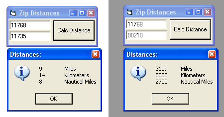



## Distance Between Two Zip Codes\. VERY LITTLE CODE\!

### Description

This code allows you to input two zip codes, and find out the Distance (In Miles, Kilometers, and Nautical Miles). The Access Database was aqcuired on this site some time ago.. so thank you to whoever it was that posted it. :) Feedback is appreciated.. and Vote if you like it.
 
### More Info
 
Two Zip Codes

Distance (In Miles, Kilometers, and Nautical Miles)

             |
---                |---
**Submitted On**   |2003-10-10 12:16:08
**By**             |[Sparq](https://github.com/Planet-Source-Code/PSCIndex/blob/master/ByAuthor/sparq.md)
**Level**          |Intermediate
**User Rating**    |5.0 (10 globes from 2 users)
**Compatibility**  |VB 6\.0, VBA MS Access, VBA MS Excel
**Category**       |[Math/ Dates](https://github.com/Planet-Source-Code/PSCIndex/blob/master/ByCategory/math-dates__1-37.md)
**World**          |[Visual Basic](https://github.com/Planet-Source-Code/PSCIndex/blob/master/ByWorld/visual-basic.md)
**Archive File**   |[Distance\_B16565410102003\.zip](https://github.com/Planet-Source-Code/sparq-distance-between-two-zip-codes-very-little-code__1-49144/archive/master.zip)

